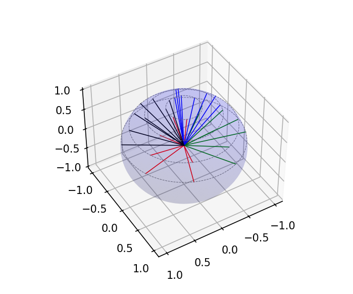

# Product Quadrature of Gauss-Legendre-Chebyshev type.
___
## Create the Angular Quadrature
  + ```nazimu``` is the number of subdivisions in **one*** quadrant of the the equatorial plane,
  + ```npolar``` is the number of **positive** polar cosines.

Hence, there will be $nazimu \times npolar$ directions per octant.

In 2D XY geometry, we only use 4 octants instead of 8 octants.
```
--################################################
nazimu = 2
npolar = 4
pb_dim=3
pquad = chiCreateProductQuadrature(GAUSS_LEGENDRE_CHEBYSHEV,nazimu,npolar)
if (pb_dim==2)
then
  chiOptimizeAngularQuadratureForPolarSymmetry(pquad, 4.0*math.pi)
end
```
### Here, we retrieve the quadrature data in lua to print it
```
qdata = chiGetProductQuadrature(pquad)

print("")
print(string.format("+---------+-------------+------------+------------+"))
print(string.format("|direction|    weight   | cos(theta) | phi (deg.) |"))
print(string.format("+---------+-------------+------------+------------+"))
for d,v in pairs(qdata) do
  s = string.format("| %5d   |    %6.4f   |   %7.4f  |   %7.3f  |",d, v.weight, math.cos(v.polar), v.azimuthal*180.0/math.pi)
  print(s)
end
print(string.format("+---------+-------------+------------+------------+\n"))

```
### Printing quadrature data to a file for subsequent plotting.

You can plot the directions of the quadrature using the [Python script plot_ang_quad.py](./plot_ang_quad.py) found in this same folder.

A sample plot is shown below:



```
-- Opens a file in write mode
filename = "qdata_na" .. tostring(nazimu) .. "_np" .. tostring(npolar) .. ".csv"
fhandle = io.open (filename , "w")

-- sets the default output file
io.output(fhandle)

-- write to the file
for d,v in pairs(qdata) do
  io.write(v.weight, ", ", math.cos(v.polar), ", ", v.azimuthal, "\n")
end

-- closes the open file
io.close(fhandle)

```
## Print a few Spherical Harmonic for a given direction
```
if (pb_dim==2)
then
   increment=2
else
   increment=1
end
-- selected direction
di=2

print(string.format("+-------+--------+------------+-----------+---------------+"))
print(string.format("|   l   |    m   |theta (deg.)| phi (deg.)|Y_lm(theta,phi)|"))
print(string.format("+-------+--------+------------+-----------+---------------+"))
for L1=0,3 do
   for M1=-L1,L1,increment do
      polar = qdata[di].polar
      azimu = qdata[di].azimuthal
      val1 = chiYlm(L1, M1, polar, azimu)
      s = string.format("|  %3d  |  %3d   |   %7.2f  |  %7.2f  |     %6.4f    |",L1, M1, polar*180.0/math.pi, azimu*180.0/math.pi, val1)
      print(s)
   end
end
print(string.format("+------+--------+------------+-----------+----------------+\n"))

```
## Checking Orthogonality of Spherical Harmonic Functions
```
print(string.format("+-------+-------+-------+-------+---------------+"))
print(string.format("|   l1  |   m1  |   l2  |   m2  | orthogonality |"))
print(string.format("+-------+-------+-------+-------+---------------+"))
for L1=0,3 do
   for M1=-L1,L1,increment do
      for L2=0,3 do
         for M2=-L2,L2,increment do
            integral=0.
            for d,v in pairs(qdata) do
               weight = v.weight
               polar = v.polar
               azimu = v.azimuthal
               val1 = chiYlm(L1, M1, polar, azimu)
               val2 = chiYlm(L2, M2, polar, azimu)
               integral = integral + weight * val1 * val2
            end
            s = string.format("|  %3d  |  %3d  |  %3d  |  %3d  |  %+8.4f     |",L1, M1, L2, M2, integral)
            print(s)
         end
      end
   end
end
print(string.format("+-------+-------+-------+-------+---------------+\n"))

```
### Another manner to print out data
The lua code below is current unused, see commented line.
```
--################################################
-- Print contents of `tbl`, with indentation.
-- `indent` sets the initial level of indentation.
-- Usage: tprint(qdata)
function tprint (tbl, indent)
  if not indent then indent = 0 end
  for k, v in pairs(tbl) do
    formatting = string.rep("  ", indent) .. k .. ": "
    if type(v) == "table" then
      print(formatting)
      tprint(v, indent+1)
    elseif type(v) == 'boolean' then
      print(formatting .. tostring(v))
    else
      print(formatting .. v)
    end
  end
end
```
___
## The complete input is below:
You can copy/paste it or look in the file named ```./angular_quad/productGLC.lua```:
```
--################################################
nazimu = 2
npolar = 4
pb_dim=3
pquad = chiCreateProductQuadrature(GAUSS_LEGENDRE_CHEBYSHEV,nazimu,npolar)
if (pb_dim==2)
then
  chiOptimizeAngularQuadratureForPolarSymmetry(pquad, 4.0*math.pi)
end
qdata = chiGetProductQuadrature(pquad)

print("")
print(string.format("+---------+-------------+------------+------------+"))
print(string.format("|direction|    weight   | cos(theta) | phi (deg.) |"))
print(string.format("+---------+-------------+------------+------------+"))
for d,v in pairs(qdata) do
  s = string.format("| %5d   |    %6.4f   |   %7.4f  |   %7.3f  |",d, v.weight, math.cos(v.polar), v.azimuthal*180.0/math.pi)
  print(s)
end
print(string.format("+---------+-------------+------------+------------+\n"))

-- Opens a file in write mode
filename = "qdata_na" .. tostring(nazimu) .. "_np" .. tostring(npolar) .. ".csv"
fhandle = io.open (filename , "w")

-- sets the default output file
io.output(fhandle)

-- write to the file
for d,v in pairs(qdata) do
  io.write(v.weight, ", ", math.cos(v.polar), ", ", v.azimuthal, "\n")
end

-- closes the open file
io.close(fhandle)

if (pb_dim==2)
then
   increment=2
else
   increment=1
end
-- selected direction
di=2

print(string.format("+-------+--------+------------+-----------+---------------+"))
print(string.format("|   l   |    m   |theta (deg.)| phi (deg.)|Y_lm(theta,phi)|"))
print(string.format("+-------+--------+------------+-----------+---------------+"))
for L1=0,3 do
   for M1=-L1,L1,increment do
      polar = qdata[di].polar
      azimu = qdata[di].azimuthal
      val1 = chiYlm(L1, M1, polar, azimu)
      s = string.format("|  %3d  |  %3d   |   %7.2f  |  %7.2f  |     %6.4f    |",L1, M1, polar*180.0/math.pi, azimu*180.0/math.pi, val1)
      print(s)
   end
end
print(string.format("+------+--------+------------+-----------+----------------+\n"))

print(string.format("+-------+-------+-------+-------+---------------+"))
print(string.format("|   l1  |   m1  |   l2  |   m2  | orthogonality |"))
print(string.format("+-------+-------+-------+-------+---------------+"))
for L1=0,3 do
   for M1=-L1,L1,increment do
      for L2=0,3 do
         for M2=-L2,L2,increment do
            integral=0.
            for d,v in pairs(qdata) do
               weight = v.weight
               polar = v.polar
               azimu = v.azimuthal
               val1 = chiYlm(L1, M1, polar, azimu)
               val2 = chiYlm(L2, M2, polar, azimu)
               integral = integral + weight * val1 * val2
            end
            s = string.format("|  %3d  |  %3d  |  %3d  |  %3d  |  %+8.4f     |",L1, M1, L2, M2, integral)
            print(s)
         end
      end
   end
end
print(string.format("+-------+-------+-------+-------+---------------+\n"))

--################################################
-- Print contents of `tbl`, with indentation.
-- `indent` sets the initial level of indentation.
-- Usage: tprint(qdata)
function tprint (tbl, indent)
  if not indent then indent = 0 end
  for k, v in pairs(tbl) do
    formatting = string.rep("  ", indent) .. k .. ": "
    if type(v) == "table" then
      print(formatting)
      tprint(v, indent+1)
    elseif type(v) == 'boolean' then
      print(formatting .. tostring(v))
    else
      print(formatting .. v)
    end
  end
end
```
___
Back to [**Tutorial Home**](../tutorials_transport.md#first_example)