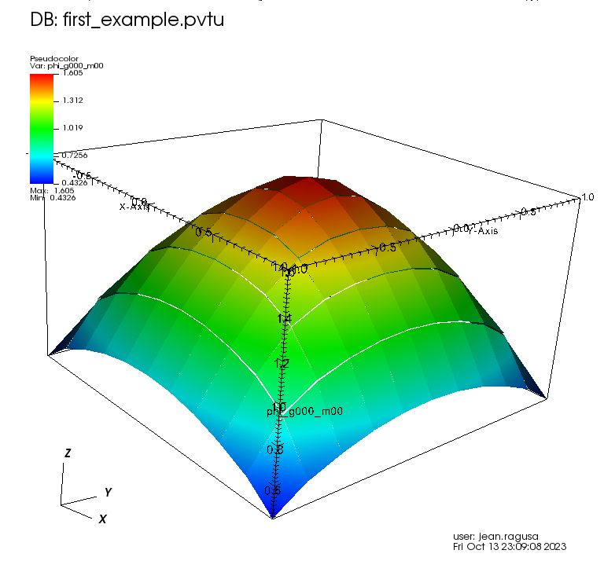

<script type="text/javascript"
  src="https://cdnjs.cloudflare.com/ajax/libs/mathjax/2.7.0/MathJax.js?config=TeX-AMS_CHTML">
</script>
<script type="text/x-mathjax-config">
  MathJax.Hub.Config({
    tex2jax: {
      inlineMath: [['$','$'], ['\\(','\\)']],
      processEscapes: true},
      jax: ["input/TeX","input/MathML","input/AsciiMath","output/CommonHTML"],
      extensions: ["tex2jax.js","mml2jax.js","asciimath2jax.js","MathMenu.js","MathZoom.js","AssistiveMML.js", "[Contrib]/a11y/accessibility-menu.js"],
      TeX: {
      extensions: ["AMSmath.js","AMSsymbols.js","noErrors.js","noUndefined.js"],
      equationNumbers: {
      autoNumber: "AMS"
      }
    }
  });
</script>

 # A first example: 2D Transport test with Vacuum BC and Isotropic External Volumetric Source.
 ___
 ## Check the number of processes requested
 This is not mandatory, as a user may want to run the code with different numbers of processes. However,
 this is often used in the many examples found in the regression suite, so we explain this practice early on:
 + ```check_num_procs==nil``` will be true when running serially without MPI
 + ```chi_number_of_processes ~= num_procs``` will be true when the number of MPI processes requested is not equal to the preset value of ```4```.

 To run the code, simply type ```mpiexec -n 4 *path*/bin/ChiTech  *input_filename*.lua```
 For more runtime options, type ```*path*/bin/ChiTech -h``` for help.
```
--############################################### Check num_procs
num_procs = 4
if (check_num_procs==nil and chi_number_of_processes ~= num_procs) then
  chiLog(LOG_0ERROR,"Incorrect amount of processors. " ..
    "Expected "..tostring(num_procs)..
    ". Pass check_num_procs=false to override if possible.")
  os.exit(false)
end

```
 ## Mesh
 Here, we will use the in-house mesh generator for a simple Cartesian grid.
 ### List of nodes
 We first create a lua table for the list of nodes.
 Be mindful that lua indexing starts at 1.
```
--############################################### Setup mesh
nodes={}
n_cells=10
length=2.
xmin = -length/2.
dx = length/n_cells
for i=1,(n_cells+1) do
    k=i-1
    nodes[i] = xmin + k*dx
end
```
 ### Orthogonal Mesh Generation
 We use the ```OrthogonalMeshGenerator``` and pass the list of nodes per dimension. Here, we pass 2 times the same list of nodes to create a 2D geometry with square cells.

 We also partition the 2D mesh into 2x2 subdomains using ```KBAGraphPartitioner```. Since we want the split the x-axis in 2, we give only 1 value in the xcuts array. Likewise for ycuts. The assignment to a partition is done based on where the cell center is located with respect to the various xcuts, ycuts, and zcuts (a fuzzy logic is applied to avoid issues).

 The resulting mesh and partition is shown below:
 
```
meshgen = chi_mesh.OrthogonalMeshGenerator.Create
({
  node_sets = {nodes,nodes},
  partitioner = chi.KBAGraphPartitioner.Create
  ({
    nx = 2, ny=2,
    xcuts = {0.0}, ycuts = {0.0},
  })
})

chi_mesh.MeshGenerator.Execute(meshgen)

```
 ### Material IDs
 We create a right parallelepiped logical volume that contains the entire mesh and we assign a 0 for material ID to all cells found inside the logical volume. Logical volumes are quite powerful, see subsequent tutorials on meshing.
```
--############################################### Set Material IDs
vol0 = chi_mesh.RPPLogicalVolume.Create({infx=true, infy=true, infz=true})
chiVolumeMesherSetProperty(MATID_FROMLOGICAL,vol0,0)

```
 ## Materials
 We create a material and add two properties to it:
 + TRANSPORT_XSECTIONS for the transport cross sections, and
 + ISOTROPIC_MG_SOURCE for the isotropic volumetric source
```
--############################################### Add materials
materials = {}
materials[1] = chiPhysicsAddMaterial("Material_A");

chiPhysicsMaterialAddProperty(materials[1],TRANSPORT_XSECTIONS)
chiPhysicsMaterialAddProperty(materials[1],ISOTROPIC_MG_SOURCE)

```
 ## Cross Sections
 We assign the cross sections to the material by loading the file containing the cross sections.
```
chiPhysicsMaterialSetProperty(materials[1],TRANSPORT_XSECTIONS,
  CHI_XSFILE,"xs_1g_MatA.cxs")

```
 ## Volumetric Source
 We create a lua table containing the volumetric multigroup source and assign it to the material by passing that array.
```
num_groups = 1
src={}
for g=1,num_groups do
  src[g] = 1.0
end
chiPhysicsMaterialSetProperty(materials[1],ISOTROPIC_MG_SOURCE,FROM_ARRAY,src)

```
 ## Angular Quadrature
 We call a product Gauss-Legendre-Chebyshev quadrature and pass the number of **positive** polar cosines (here ```npolar = 2```) and the number of azimuthal subdivisions in **one quadrant** (```nazimu = 1```). This creates a 3D angular quadrature.

 We finish by optimizing the quadrature to only use the positive hemisphere for 2D simulations.
```
--############################################### Setup the Angular Quadrature
nazimu = 1
npolar = 2
pquad = chiCreateProductQuadrature(GAUSS_LEGENDRE_CHEBYSHEV,nazimu,npolar)
chiOptimizeAngularQuadratureForPolarSymmetry(pquad, 4.0*math.pi)

--############################################### Setup LBS parameters
```
 ## Linear Boltzmann Solver
 ### Options for the Linear Boltzmann Solver (LBS)
 In the LBS block, we provide
 + the number of energy groups,
 + the groupsets (with 0-indexing), the handle for the angular quadrature, the angle aggregation, the solver type, tolerances, and other solver options.
```
lbs_block =
{
  num_groups = num_groups,
  groupsets =
  {
    {
      groups_from_to = {0, 0},
      angular_quadrature_handle = pquad,
      angle_aggregation_num_subsets = 1,
      inner_linear_method = "gmres",
      l_abs_tol = 1.0e-6,
      l_max_its = 300,
      gmres_restart_interval = 30,
    }
  }
}
```
 ### Further Options for the Linear Boltzmann Solver
 In the LBS options, we pass the maximum scattering order to be employed (should be less than the one supplied the cross section file)
```
lbs_options =
{
  scattering_order = 0,
}
```
 ### Putting the Linear Boltzmann Solver Together
 We create the physics solver, initialize it, and execute it,
```
phys = lbs.DiscreteOrdinatesSolver.Create(lbs_block)
lbs.SetOptions(phys, lbs_options)

--############################################### Initialize and Execute Solver
ss_solver = lbs.SteadyStateSolver.Create({lbs_solver_handle = phys})

chiSolverInitialize(ss_solver)
chiSolverExecute(ss_solver)

```
 ## Post-Processing via Field Functions
 We extract the scalar flux (i.e., the first entry in the field function list; recall that lua indexing starts at 1) and export it to a VTK file whose name is supplied by the user.

 The resulting scalar flux is shown below:
 
```
--############################################### Get field functions
fflist,count = chiLBSGetScalarFieldFunctionList(phys)
vtk_basename = "first_example"
chiExportFieldFunctionToVTK(fflist[1],vtk_basename)

```
 ## Possible Extensions:
 1. Change the number of MPI processes (you may want to delete the safeguard at the top of the input file to run with any number of MPI ranks);
 2. Change the spatial resolution by increasing or decreasing the number of cells;
 3. Change the angular resolution by increasing or decrasing the number of polar and azimuthal subdivisions.
___
## The complete input is below:
You can copy/paste it or look in the file named ```./first/first_example.lua```:
```
--############################################### Check num_procs
num_procs = 4
if (check_num_procs==nil and chi_number_of_processes ~= num_procs) then
  chiLog(LOG_0ERROR,"Incorrect amount of processors. " ..
    "Expected "..tostring(num_procs)..
    ". Pass check_num_procs=false to override if possible.")
  os.exit(false)
end

--############################################### Setup mesh
nodes={}
n_cells=10
length=2.
xmin = -length/2.
dx = length/n_cells
for i=1,(n_cells+1) do
    k=i-1
    nodes[i] = xmin + k*dx
end
meshgen = chi_mesh.OrthogonalMeshGenerator.Create
({
  node_sets = {nodes,nodes},
  partitioner = chi.KBAGraphPartitioner.Create
  ({
    nx = 2, ny=2,
    xcuts = {0.0}, ycuts = {0.0},
  })
})

chi_mesh.MeshGenerator.Execute(meshgen)

--############################################### Set Material IDs
vol0 = chi_mesh.RPPLogicalVolume.Create({infx=true, infy=true, infz=true})
chiVolumeMesherSetProperty(MATID_FROMLOGICAL,vol0,0)

--############################################### Add materials
materials = {}
materials[1] = chiPhysicsAddMaterial("Material_A");

chiPhysicsMaterialAddProperty(materials[1],TRANSPORT_XSECTIONS)
chiPhysicsMaterialAddProperty(materials[1],ISOTROPIC_MG_SOURCE)

chiPhysicsMaterialSetProperty(materials[1],TRANSPORT_XSECTIONS,
  CHI_XSFILE,"xs_1g_MatA.cxs")

num_groups = 1
src={}
for g=1,num_groups do
  src[g] = 1.0
end
chiPhysicsMaterialSetProperty(materials[1],ISOTROPIC_MG_SOURCE,FROM_ARRAY,src)

--############################################### Setup the Angular Quadrature
nazimu = 1
npolar = 2
pquad = chiCreateProductQuadrature(GAUSS_LEGENDRE_CHEBYSHEV,nazimu,npolar)
chiOptimizeAngularQuadratureForPolarSymmetry(pquad, 4.0*math.pi)

--############################################### Setup LBS parameters
lbs_block =
{
  num_groups = num_groups,
  groupsets =
  {
    {
      groups_from_to = {0, 0},
      angular_quadrature_handle = pquad,
      angle_aggregation_num_subsets = 1,
      inner_linear_method = "gmres",
      l_abs_tol = 1.0e-6,
      l_max_its = 300,
      gmres_restart_interval = 30,
    }
  }
}
lbs_options =
{
  scattering_order = 0,
}
phys = lbs.DiscreteOrdinatesSolver.Create(lbs_block)
lbs.SetOptions(phys, lbs_options)

--############################################### Initialize and Execute Solver
ss_solver = lbs.SteadyStateSolver.Create({lbs_solver_handle = phys})

chiSolverInitialize(ss_solver)
chiSolverExecute(ss_solver)

--############################################### Get field functions
fflist,count = chiLBSGetScalarFieldFunctionList(phys)
vtk_basename = "first_example"
chiExportFieldFunctionToVTK(fflist[1],vtk_basename)

```
___
Back to [**Tutorial Home**](../tutorials_transport.md#first_example)