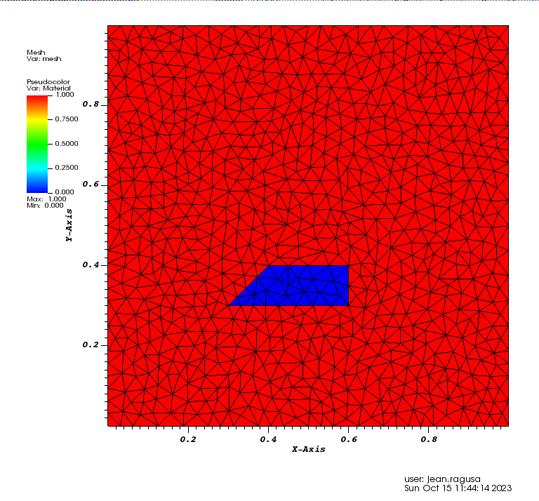
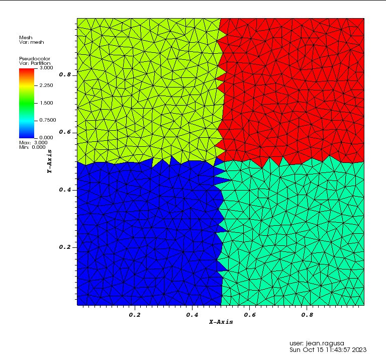
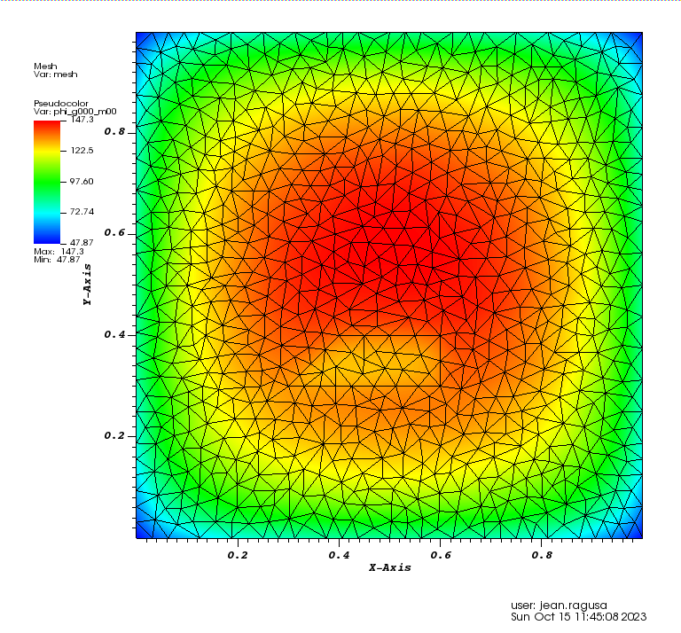

# Read a 2D obj mesh
___

Click here for more information on [WaveFront objects]()

## Create an Unstructured Triangular Mesh with the Triangle Mesh Generator (via MeshPy)

The [Python script triangle_mesh_export_wavefront.py](./triangle_mesh_export_wavefront.py) found in this same folder
will guide you through the process of filling the information in triangle.MeshInfo() in order to call the triangle.build()
function of [MeshPy](https://documen.tician.de/meshpy/).

Alternatively, you can create the meshing data directly with the [Triangle Mesh Generator](http://www.cs.cmu.edu/~quake/triangle.html)
and use our Python script to only convert the Triangle data into the WaveFront object.

## Reading the Mesh
We use the ```FromFileMeshGenerator``` and pass the path to the obj file.

We also partition the 2D mesh into 2x2 subdomains using ```KBAGraphPartitioner```.
Since we want the split the x-axis in 2, we give only 1 value in the xcuts array.
Likewise for ycuts. The assignment to a partition is done based on where the cell center is located with respect to
the various xcuts, ycuts, and zcuts (a fuzzy logic is applied to avoid issues).


Finally, we export the mesh to a VTU file.

The resulting mesh and material layout is shown below:


The resulting mesh and partition is shown below:


```
--############################################### Setup mesh
meshgen = chi_mesh.MeshGenerator.Create
({
  inputs =
  {
    chi_mesh.FromFileMeshGenerator.Create
    ({
        filename="./tri_2mat_bc_1542.obj"
    }),
  },
  partitioner = chi.KBAGraphPartitioner.Create
  ({
    nx = 2, ny=2, nz=1,
    xcuts = {0.5}, ycuts = {0.5},
  })
})

chi_mesh.MeshGenerator.Execute(meshgen)
chiMeshHandlerExportMeshToVTK("Triangle_1542_mesh_only")

```
## The rest of the simulation
The following line inserts the rest of the simulation data:
+ materials and sources
+ angular quadrature
+ LBS solver options and execution
+ VTK post-processing

You can view it [here](transport_simulation_part.md)

The resulting scalar flux is shown below:


```
--############################################### rest of the simulation
dofile("transport_simulation_part.lua")

```
___
## The complete input is below:
You can copy/paste it or look in the file named ```./meshing/read_2D_obj_mesh.lua```:
```
--############################################### Setup mesh
meshgen = chi_mesh.MeshGenerator.Create
({
  inputs =
  {
    chi_mesh.FromFileMeshGenerator.Create
    ({
        filename="./tri_2mat_bc_1542.obj"
    }),
  },
  partitioner = chi.KBAGraphPartitioner.Create
  ({
    nx = 2, ny=2, nz=1,
    xcuts = {0.5}, ycuts = {0.5},
  })
})

chi_mesh.MeshGenerator.Execute(meshgen)
chiMeshHandlerExportMeshToVTK("Triangle_1542_mesh_only")

--############################################### rest of the simulation
dofile("transport_simulation_part.lua")

```
___
Back to [**Tutorial Home**](../tutorials_transport.md#first_example)